# TP1

## Build : 
```docker build . -t tp1_bdd```

run : 
```
docker run -p 15432:5432 --name tp1_bdd tp1_bdd

create network
docker network create app-network
```

### restart the admiter:
```
docker run \
    -p "8088:8080" \
    --net=app-network \
    --name=adminer \
    -d \
    adminer
```

Thanks to admiter, I can administrate the db by login in using : 
- Postgres
- tp1_bdd:5432
- usr
- pwd
- db

### Update dockerfile to initiate DB with data : 
```COPY *.sql /docker-entrypoint-initdb.d```

then restart the db : 
```docker run -p 15432:5432 --name tp1_bdd --network app-network tp1_bdd```

### Volume : 
```sudo docker run -p 15432:5432 -v /opt/data-save:/var/lib/postgresql/data --network app-network -d --name tp1_bdd tp1_bdd```

## JAVA : 

### Write another docker file :
```
FROM maven:latest

COPY Main.class .
RUN java Main 
```

then build with the dockerfile

```docker build -t tp1_java . -f java.dockerfile```

### Compile/Run : 
Compile:

```javac Main.java```

then run with:

```docker run --name tp1_java tp1_java```

You should see "Hello world"

### Spring project: 
after generating the project and build it with the dockerfile in

we can run it with the command below in the simpleapi folder:

```docker run -p 8088:8080 --name tp1_java tp1_java```

### Why do we need a multistage build? And explain each step of this dockerfile.
It's important to multistage build to save more ressources. Using a java project as an exemple, multistage build will take a jdk and a jre, use the jdk to compile and then get rid of it to keep only the essential part witch is the .jar and the jre to execute it so it save space.

Contrary to a basic build that will keep all the resources from the build for the execution. 

### Backend API
To link the database, we need to edit application.yml:

```yaml
spring:
  jpa:
    properties:
      hibernate:
        jdbc:
          lob:
            non_contextual_creation: true
    generate-ddl: false
    open-in-view: true
  datasource:
    url: jdbc:postgresql://tp1_bdd:5432/db
    username: usr
    password: pwd
    driver-class-name: org.postgresql.Driver
management:
 server:
   add-application-context-header: false
 endpoints:
   web:
     exposure:
       include: health,info,env,metrics,beans,configprops
```

Then, go into the right folder and :

```docker run -p 8088:8080 --name tp1_java --network app-network tp1_java```

## HTTP : 
after creating a folder with a dockerfile and an another folder containing our index.html we can build and run : 

```
docker build -t http . -f http.dockerfile
docker run -p 80:80 --name frontend --network app-network frontend
```

Reverse proxy : 
Add a conf file httpd.conf at the base of the folder http :

```
<VirtualHost *:80>
ProxyPreserveHost On
ProxyPass / http://tp1_java:8080/
ProxyPassReverse / http://tp1_java:8080/
</VirtualHost>
LoadModule proxy_module modules/mod_proxy.so
LoadModule proxy_http_module modules/mod_proxy_http.so
```

then modify the docker file :
```docker
FROM httpd:latest

COPY ./httpd.conf /usr/local/apache2/conf/httpd-custom.conf
COPY ./public-html/ /usr/local/apache2/htdocs/

RUN echo "Include ./conf/httpd-custom.conf" >> /usr/local/apache2/conf/httpd.conf
```

### Docker compose: 

```yaml
version: '3.7'

services:
    backend:
      container_name: backend
      build:
        context: ./simple-api-student
        dockerfile: java.dockerfile
      networks:
        - my-network
      depends_on:
        - database

    database:
      container_name: database
      build:
        context: .
        dockerfile: Dockerfile
      volumes:
        - db:/var/lib/postgresql/data
      networks:
        - my-network

    httpd:
      container_name: frontend
      build:
        context: ./web
        dockerfile: front.dockerfile
      ports:
        - '80:80'
      networks:
        - my-network
      depends_on:
        - backend

networks:
    my-network:

volumes:
  db:
```

After that, you build and run the compose file with:

```docker compose build && docker compose up -d```

### Document docker-compose most important commands.
- ```docker compose build``` => build your containers and gather all informations necessary

- ```docker compose up -d``` => mount the containers and run them

### Document your docker-compose file.
we use 3 services inside a network and a volume for the database. Each service is link to a dockerfile, a context, a network and also if necessary a dependence.


# TP2

## Test application
To build and run the application from the root folder:

```mvn clean verify --file .\simple-api-student\pom.xml```

## What are testcontainers?
Testcontainers are lightweight libraries with an API for completing integration test with services inside containers

### CI
First, we create our environment variable in the repo:
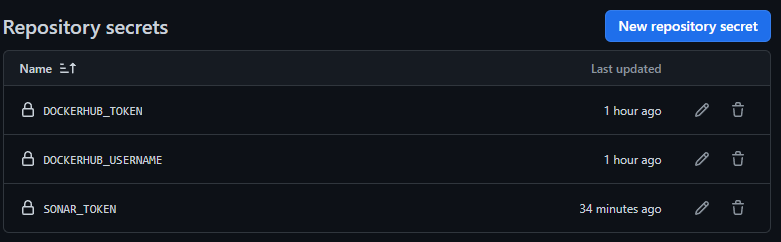

main.yml:
```yaml
name: CI devops 2023
on:
  #to begin you want to launch this job in main and develop
  push:
    branches: [main, develop] 
  pull_request:

jobs:
  test-backend: 
    runs-on: ubuntu-22.04
    steps:
     #checkout your github code using actions/checkout@v2.5.0
      - uses: actions/checkout@v2.5.0

     #do the same with another action (actions/setup-java@v3) that enable to setup jdk 17
      - name: Set up JDK 17
        uses: actions/setup-java@v3
        with:
        #precise java version & distribution (Eclipse Temurin, Oracle JDK, ...)
          java-version: 17
          distribution: 'temurin'

     #finally build your app with the latest command
      - name: Build and test with Maven
        run: mvn clean verify --file simple-api-student/pom.xml
```

We test the workflow in github actions:
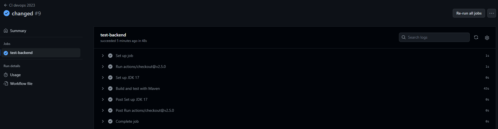

### CD
You add a new job in main.yml workflow file:

```yml
# define job to build and publish docker image
build-and-push-docker-image:
needs: test-backend
# run only when code is compiling and tests are passing
runs-on: ubuntu-22.04

# steps to perform in job
steps:
    - name: Checkout code
    uses: actions/checkout@v2.5.0

    - name: Login to DockerHub
    run: docker login -u ${{ secrets.DOCKERHUB_USERNAME }} -p ${{ secrets.DOCKERHUB_TOKEN }}

    - name: Build image and push backend
    uses: docker/build-push-action@v3
    with:
        # relative path to the place where source code with Dockerfile is located
        context: ./simple-api-student
        # Note: tags has to be all lower-case
        tags: ${{secrets.DOCKERHUB_USERNAME}}/tp2-devops-simple-api:latest
        # build on feature branches, push only on main branch
        push: ${{ github.ref == 'refs/heads/main' }}

    - name: Build image and push database
    uses: docker/build-push-action@v3
    with:
        context: ./db

        tags: ${{secrets.DOCKERHUB_USERNAME}}/tp2-devops-database:latest
        push: ${{ github.ref == 'refs/heads/main' }}

    - name: Build image and push httpd
    uses: docker/build-push-action@v3
    with:
        context: ./web

        tags: ${{secrets.DOCKERHUB_USERNAME}}/tp2-devops-front:latest
        push: ${{ github.ref == 'refs/heads/main' }}
```

We test the workflow again in github actions:
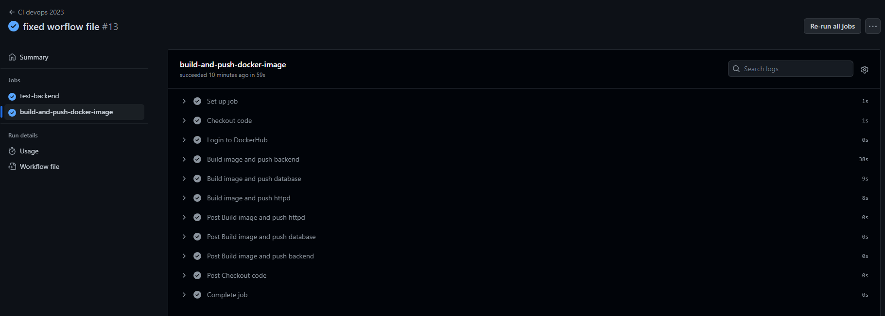

## Sonar
After creating the organisation on SonarCloud, you edit the build and test job in the workflow file:

```yml
run: mvn -B verify sonar:sonar -Dsonar.projectKey=GTK188_CPE_S8_DevOps -Dsonar.organization=gtk188 -Dsonar.host.url=https://sonarcloud.io -Dsonar.login=${{ secrets.SONAR_TOKEN }}  --file ./simple-api-student/pom.xml
```

A SonarCloud analysis report should appear:
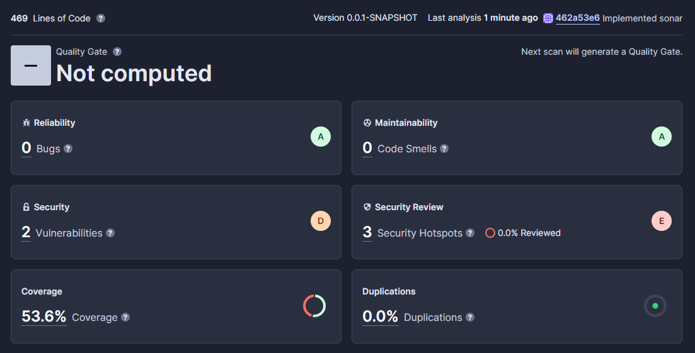

### Split pipeline
I separate the workflow into 2 files:
- One that test the backend:
```yml
name: Test backend

on:
  #to begin you want to launch this job in main and develop
  push:
    branches: [main, develop] 

jobs:
  test-backend: 
    runs-on: ubuntu-22.04
    steps:
     #checkout your github code using actions/checkout@v2.5.0
      - uses: actions/checkout@v2.5.0

     #do the same with another action (actions/setup-java@v3) that enable to setup jdk 17
      - name: Set up JDK 17
        uses: actions/setup-java@v3
        with:
          java-version: 17
          distribution: 'temurin'

     #finally build your app with the latest command
      - name: Build and test with Maven
        run: mvn -B verify sonar:sonar -Dsonar.projectKey=GTK188_CPE_S8_DevOps -Dsonar.organization=gtk188 -Dsonar.host.url=https://sonarcloud.io -Dsonar.login=${{ secrets.SONAR_TOKEN }}  --file ./simple-api-student/pom.xml
```

- And one for the build & push of docker images :
```yml
name: Build and push docker image

on:
  workflow_run:
    workflows:
      - Test backend
    types:
      - completed 
    branches:
      - main

jobs:
  # define job to build and publish docker image
  build-and-push-docker-image:
    runs-on: ubuntu-22.04

    # steps to perform in job
    steps:
      - name: Checkout code
        uses: actions/checkout@v2.5.0

      - name: Login to DockerHub
        run: docker login -u ${{ secrets.DOCKERHUB_USERNAME }} -p ${{ secrets.DOCKERHUB_TOKEN }}

      - name: Build image and push backend
        uses: docker/build-push-action@v3
        with:
          # relative path to the place where source code with Dockerfile is located
          context: ./simple-api-student
          # Note: tags has to be all lower-case
          tags: ${{secrets.DOCKERHUB_USERNAME}}/tp2-devops-simple-api:latest
          # build on feature branches, push only on main branch
          push: ${{ github.ref == 'refs/heads/main' }}

      - name: Build image and push database
        uses: docker/build-push-action@v3
        with:
          context: ./db

          tags: ${{secrets.DOCKERHUB_USERNAME}}/tp2-devops-database:latest
          push: ${{ github.ref == 'refs/heads/main' }}

      - name: Build image and push httpd
        uses: docker/build-push-action@v3
        with:
          context: ./web

          tags: ${{secrets.DOCKERHUB_USERNAME}}/tp2-devops-front:latest
          push: ${{ github.ref == 'refs/heads/main' }}
```

Using this code, we ensure that the second workflow starts only if the first workflow is completed on the main branch:
```yml
workflow_run:
  workflows:
    - Test backend
  types:
    - completed 
  branches:
    - main
```


# TP3

## Introduction
### Inventories
We edit the ansible/inventories/setup.yml file with correct informations:
```yml
all:
  #credentials list
  vars:
    ansible_user: centos
    ansible_ssh_private_key_file: ~/id_rsa
  #host list
  children:
    prod:
      hosts: loan.aubry.takima.cloud
```
With this setup file, we have a list of servers with all the credentials needed inside to log in.

We then test the inventory:
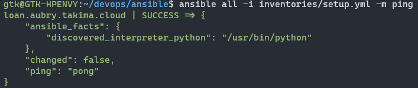

## Playbook
### Simple playbook
We create a simple playbook:
```yml
- hosts: all
  gather_facts: false
  become: true

  tasks:
    - name: Test connection
      ping:
```
This playbook will ping as a super user all hosts inside a given inventory file.

We then execute the playbook with our inventory file:
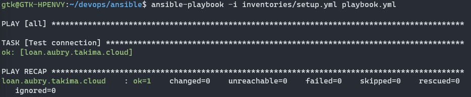

### Advanced playbook
We create a new playbook thet will install and start docker on the hosts:
```yml
- hosts: all
  gather_facts: false
  become: true

# Install Docker
  tasks:

  - name: Install device-mapper-persistent-data
    yum:
      name: device-mapper-persistent-data
      state: latest

  - name: Install lvm2
    yum:
      name: lvm2
      state: latest

  - name: add repo docker
    command:
      cmd: sudo yum-config-manager --add-repo=https://download.docker.com/linux/centos/docker-ce.repo

  - name: Install Docker
    yum:
      name: docker-ce
      state: present

  - name: Install python3
    yum:
      name: python3
      state: present

  - name: Install docker with Python 3
    pip:
      name: docker
      executable: pip3
    vars:
      ansible_python_interpreter: /usr/bin/python3

  - name: Make sure Docker is running
    service: name=docker state=started
    tags: docker
```
This playbook use yum packet manager to install all the dependencies necessary for docker to work properly.

We then execute this playbook to install docker on the server:
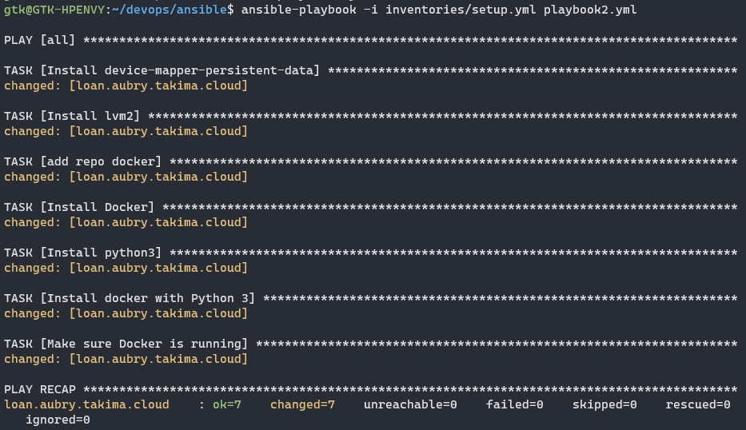

### Roles
For our docker install, we need to create a docker role so it's cleaner. We'll use this command:

```ansible-galaxy init roles/docker```

We then create a new file tasks inside the docker roles folder that will contains all the task of our playbook ```ansible/roles/docker/tasks/main.yml```:
```yml
---
# tasks file for roles/docker
- name: Install device-mapper-persistent-data
  yum:
    name: device-mapper-persistent-data
    state: latest

- name: Install lvm2
  yum:
    name: lvm2
    state: latest

- name: add repo docker
  command:
    cmd: sudo yum-config-manager --add-repo=https://download.docker.com/linux/centos/docker-ce.repo

- name: Install Docker
  yum:
    name: docker-ce
    state: present

- name: Install python3
  yum:
    name: python3
    state: present

- name: Install docker with Python 3
  pip:
    name: docker
    executable: pip3
  vars:
    ansible_python_interpreter: /usr/bin/python3

- name: Make sure Docker is running
  service: name=docker state=started
  tags: docker
```
We then edit our first playbook to use the right role:
```yml
- hosts: all
  gather_facts: false
  become: true

  roles:
    - docker
```

Our tree will now looks like this:
```
gtk@GTK-HPENVY:~/devops$ tree
.
└── ansible
    ├── inventories
    │   └── setup.yml
    ├── playbook.yml
    └── roles
        └── docker
            ├── README.md
            ├── defaults
            │   └── main.yml
            ├── files
            ├── handlers
            │   └── main.yml
            ├── meta
            │   └── main.yml
            ├── tasks
            │   └── main.yml
            ├── templates
            ├── tests
            │   ├── inventory
            │   └── test.yml
            └── vars
                └── main.yml
```

## Deploy your app
After creating new 5 roles, the project look likes that:
```
gtk@GTK-HPENVY:~/devops$ tree
.
└── ansible
    ├── inventories
    │   └── setup.yml
    ├── playbook.yml
    └── roles
        ├── create-network
        │   ├── README.md
        │   ├── defaults
        │   │   └── main.yml
        │   ├── files
        │   ├── handlers
        │   │   └── main.yml
        │   ├── meta
        │   │   └── main.yml
        │   ├── tasks
        │   │   └── main.yml
        │   ├── templates
        │   ├── tests
        │   │   ├── inventory
        │   │   └── test.yml
        │   └── vars
        │       └── main.yml
        ├── docker
        │   ├── README.md
        │   ├── defaults
        │   │   └── main.yml
        │   ├── files
        │   ├── handlers
        │   │   └── main.yml
        │   ├── meta
        │   │   └── main.yml
        │   ├── tasks
        │   │   └── main.yml
        │   ├── templates
        │   ├── tests
        │   │   ├── inventory
        │   │   └── test.yml
        │   └── vars
        │       └── main.yml
        ├── install-docker
        │   ├── README.md
        │   ├── defaults
        │   │   └── main.yml
        │   ├── files
        │   ├── handlers
        │   │   └── main.yml
        │   ├── meta
        │   │   └── main.yml
        │   ├── tasks
        │   │   └── main.yml
        │   ├── templates
        │   ├── tests
        │   │   ├── inventory
        │   │   └── test.yml
        │   └── vars
        │       └── main.yml
        ├── launch-app
        │   ├── README.md
        │   ├── defaults
        │   │   └── main.yml
        │   ├── files
        │   ├── handlers
        │   │   └── main.yml
        │   ├── meta
        │   │   └── main.yml
        │   ├── tasks
        │   │   └── main.yml
        │   ├── templates
        │   ├── tests
        │   │   ├── inventory
        │   │   └── test.yml
        │   └── vars
        │       └── main.yml
        ├── launch-database
        │   ├── README.md
        │   ├── defaults
        │   │   └── main.yml
        │   ├── files
        │   ├── handlers
        │   │   └── main.yml
        │   ├── meta
        │   │   └── main.yml
        │   ├── tasks
        │   │   └── main.yml
        │   ├── templates
        │   ├── tests
        │   │   ├── inventory
        │   │   └── test.yml
        │   └── vars
        │       └── main.yml
        └── launch-proxy
            ├── README.md
            ├── defaults
            │   └── main.yml
            ├── files
            ├── handlers
            │   └── main.yml
            ├── meta
            │   └── main.yml
            ├── tasks
            │   └── main.yml
            ├── templates
            ├── tests
            │   ├── inventory
            │   └── test.yml
            └── vars
                └── main.yml
```
You'll then need to edit/create the following files:

- ```ansible/inventories/setup.yml```
```yml
all:
 vars:
   ansible_user: centos
   ansible_ssh_private_key_file: ~/id_rsa

   POSTGRES_DB: "db"
   POSTGRES_USER: "usr"
   POSTGRES_PASSWORD: "pwd"
   POSTGRES_HOST: "database:5432"
 children:
   prod:
     hosts: loan.aubry.takima.cloud
```

- ```ansible/roles/create-network/tasks/main.yml```
```yml
---
# tasks file for roles/create-network
- name: Create network
  docker_network:
    name: network
    state: present
```

- ```ansible/roles/install-docker/tasks/main.yml```
Same as the one in roles/docker

- ```ansible/roles/launch-app/tasks/main.yml```
```yml
---
# tasks file for roles/launch-app
- name: Launch App
  docker_container:
    name: backend
    image: gtk188/tp2-devops-simple-api:latest
    networks:
      - name: network
    env:
      PASSWORD: "{{ POSTGRES_PASSWORD }}"
      USERNAME: "{{ POSTGRES_USER }}"
      DB: "{{ POSTGRES_DB }}"
      URL: "{{ POSTGRES_HOST }}"
```

- ```ansible/roles/launch-database/tasks/main.yml```
```yml
---
# tasks file for roles/launch-database
- name: Create Volume
  docker_volume:
    name: db
    state: present

- name: Launch Database
  docker_container:
    name: database
    image: gtk188/tp2-devops-database:latest
    networks:
      - name: network
    volumes:
      - db:/var/lib/postgresql/data
    env:
      password: "{{ POSTGRES_PASSWORD }}"
      username: "{{ POSTGRES_USER }}"
      db: "{{ POSTGRES_DB }}"
      url: "{{ POSTGRES_HOST }}"
```

- ```ansible/roles/launch-proxy/tasks/main.yml```
```yml
---
# tasks file for roles/launch-proxy
- name: Run HTTPD
  docker_container:
    name: frontend
    image: gtk188/tp2-devops-front:latest
    networks:
      - name: network
    ports:
      - "80:80"
```

I've created variables in the inventory to be used in launch-database and launch-app so it's easier when credentials change.

In launch-database, I've created a volume to be used in the container.

In launch-proxy, I've opened the 80 port so you can access to the frontend.

Then we execute our playbook and we can see in the server that the containers are here and working:
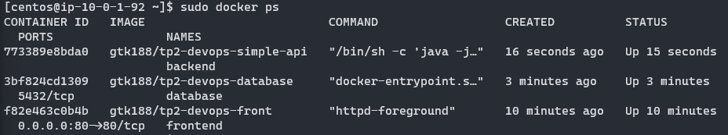

And that the API is working as intended:
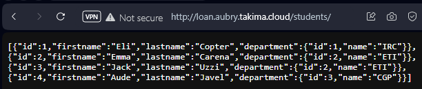

## Front

For this one, we'll need to create a new container with the code of the front ready inside:

- First, we add this in ```docker-compose.yml```:
```yml
    front-main:
      container_name: front-main
      build:
        context: ./devops-front-main
      ports:
        - '88:80'
      networks:
        - my-network
      depends_on:
        - backend
```

- Then we add this in the build & push workflow:
```yml
    - name: Build image and push front-main
      uses: docker/build-push-action@v3
      with:
        context: ./devops-front-main

        tags: ${{secrets.DOCKERHUB_USERNAME}}/tp2-devops-front-main:latest
        push: ${{ github.ref == 'refs/heads/main' }}
```

- And edit ```httpd.conf``` of the proxy:
```conf
<VirtualHost *:80>
    ServerName localhost
    ProxyPreserveHost On
    ProxyPass / http://front-main:80/
    ProxyPassReverse / http://front-main:80/
</VirtualHost>

Listen 8080
<VirtualHost *:8080>
    ServerName localhost
    ProxyPreserveHost On
    ProxyPass / http://backend:8080/
    ProxyPassReverse / http://backend:8080/
</VirtualHost>

LoadModule proxy_module modules/mod_proxy.so
LoadModule proxy_http_module modules/mod_proxy_http.so
```

- We also need to change the api url in ```.env.production```
```
VUE_APP_API_URL=loan.aubry.takima.cloud:8080
```

After building and pushing the app via Github Actions, we'll create a new role in ansible called ```launch-front``` and edit his task:
```yml
---
# tasks file for roles/launch-front
- name: Run Front
  docker_container:
    name: front-main
    image: gtk188/tp2-devops-front-main:latest
    networks:
      - name: network
```

Then, we edit ```ansible/roles/launch-proxy/tasks/main.yml``` to open the 8080 port:
```yml
---
# tasks file for roles/launch-proxy
- name: Run Proxy
  docker_container:
    name: frontend
    image: gtk188/tp2-devops-front:latest
    pull: true
    recreate: true
    networks:
      - name: network
    ports:
      - "80:80"
      - "8080:8080"
```

Don't forget to add the role in ```playbook.yml```:
```yml
- hosts: all
  gather_facts: false
  become: true

  roles:
    - install-docker
    - create-network
    - launch-database
    - launch-app
    - launch-proxy
    - launch-front
```

Then we can execute the playbook with ```ansible-playbook -i inventories/setup.yml playbook.yml```, we can see that our 4 containers are up and working and the website is working as intended:
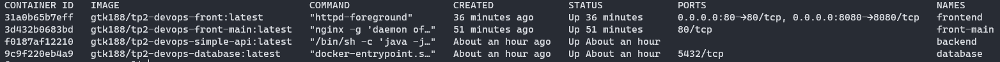
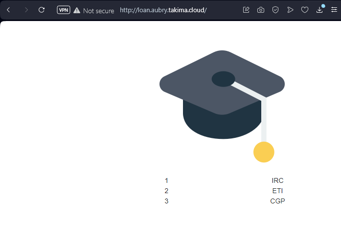

## Continuous Deployment

To add ansible to CD, we'll first add this code to ```docker-compose.yml```:
```yml
    front-main:
      container_name: front-main
      build:
        context: ./devops-front-main
      ports:
        - '88:80'
      networks:
        - my-network
      depends_on:
        - backend
```

Then, we'll create a new worflow file called ```ansible_deploy.yml```:
```yml
name: Deploy application to ansible

on:
  workflow_run:
    workflows:
      - Build and push docker image
    types:
      - completed 
    branches:
      - main

jobs:
  deploy-to-ansible:
    if: ${{ github.event.workflow_run.conclusion == 'success' }}
    runs-on: ubuntu-22.04

    steps:
      - name: Checkout code
        uses: actions/checkout@v2.5.0

      - name: Install Python + Pip + Ansible
        run: sudo apt install python3-pip && sudo apt install ansible

      - name: Setup SSH key
        run: |
          mkdir -p ~/.ssh
          ssh-keyscan -H loan.aubry.takima.cloud >> ~/.ssh/known_hosts
          echo "${{secrets.SSH_PRIVATE_KEY}}" > ~/.ssh/id_rsa
          chmod 600 ~/.ssh/id_rsa
        env:
          SSH_PRIVATE_KEY: ${{secrets.SSH_PRIVATE_KEY}}

      - name: Deploy application
        run: ansible-playbook -i ./ansible/inventories/setup.yml ./ansible/playbook.yml
```

I've created a secret variable containing the ssh private key.
The ```ssh-keyscan``` command put the server address as a known host so that the playbook can work as intended.

I've also changed the private key var in ```./ansible/inventories/setup.yml```:
```yml
   ansible_ssh_private_key_file: ~/.ssh/id_rsa
```

You can now deploy the application into the server automaticaly with Github Actions:
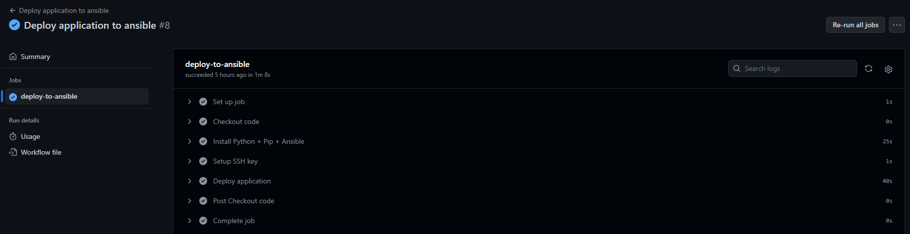

