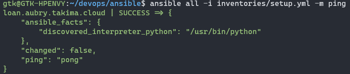
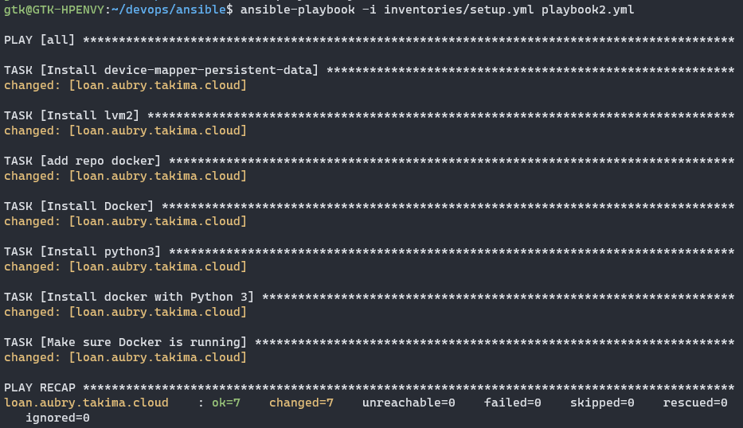

# TP3

## Introduction
### Inventories
We edit the ansible/inventories/setup.yml file with correct informations:
```yml
all:
  #credentials list
  vars:
    ansible_user: centos
    ansible_ssh_private_key_file: ~/id_rsa
  #host list
  children:
    prod:
      hosts: loan.aubry.takima.cloud
```
With this setup file, we have a list of servers with all the credentials needed inside to log in.

We then test the inventory:


## Playbook
### Simple playbook
We create a simple playbook:
```yml
- hosts: all
  gather_facts: false
  become: true

  tasks:
    - name: Test connection
      ping:
```
This playbook will ping as a super user all hosts inside a given inventory file.

We then execute the playbook with our inventory file:


### Advanced playbook
We create a new playbook thet will install and start docker on the hosts:
```yml
- hosts: all
  gather_facts: false
  become: true

# Install Docker
  tasks:

  - name: Install device-mapper-persistent-data
    yum:
      name: device-mapper-persistent-data
      state: latest

  - name: Install lvm2
    yum:
      name: lvm2
      state: latest

  - name: add repo docker
    command:
      cmd: sudo yum-config-manager --add-repo=https://download.docker.com/linux/centos/docker-ce.repo

  - name: Install Docker
    yum:
      name: docker-ce
      state: present

  - name: Install python3
    yum:
      name: python3
      state: present

  - name: Install docker with Python 3
    pip:
      name: docker
      executable: pip3
    vars:
      ansible_python_interpreter: /usr/bin/python3

  - name: Make sure Docker is running
    service: name=docker state=started
    tags: docker
```
This playbook use yum packet manager to install all the dependencies necessary for docker to work properly.

We then execute this playbook to install docker on the server:


### Roles
For our docker install, we need to create a docker role so it's cleaner. We'll use this command:

```ansible-galaxy init roles/docker```

We then create a new file tasks inside the docker roles folder that will contains all the task of our playbook ```ansible/roles/docker/tasks/main.yml```:
```yml
---
# tasks file for roles/docker
- name: Install device-mapper-persistent-data
  yum:
    name: device-mapper-persistent-data
    state: latest

- name: Install lvm2
  yum:
    name: lvm2
    state: latest

- name: add repo docker
  command:
    cmd: sudo yum-config-manager --add-repo=https://download.docker.com/linux/centos/docker-ce.repo

- name: Install Docker
  yum:
    name: docker-ce
    state: present

- name: Install python3
  yum:
    name: python3
    state: present

- name: Install docker with Python 3
  pip:
    name: docker
    executable: pip3
  vars:
    ansible_python_interpreter: /usr/bin/python3

- name: Make sure Docker is running
  service: name=docker state=started
  tags: docker
```
We then edit our first playbook to use the right role:
```yml
- hosts: all
  gather_facts: false
  become: true

  roles:
    - docker
```

Our tree will now looks like this:
```
gtk@GTK-HPENVY:~/devops$ tree
.
└── ansible
    ├── inventories
    │   └── setup.yml
    ├── playbook.yml
    └── roles
        └── docker
            ├── README.md
            ├── defaults
            │   └── main.yml
            ├── files
            ├── handlers
            │   └── main.yml
            ├── meta
            │   └── main.yml
            ├── tasks
            │   └── main.yml
            ├── templates
            ├── tests
            │   ├── inventory
            │   └── test.yml
            └── vars
                └── main.yml
```

## Deploy your app
After creating new 5 roles, the project look likes that:
```
gtk@GTK-HPENVY:~/devops$ tree
.
└── ansible
    ├── inventories
    │   └── setup.yml
    ├── playbook.yml
    └── roles
        ├── create-network
        │   ├── README.md
        │   ├── defaults
        │   │   └── main.yml
        │   ├── files
        │   ├── handlers
        │   │   └── main.yml
        │   ├── meta
        │   │   └── main.yml
        │   ├── tasks
        │   │   └── main.yml
        │   ├── templates
        │   ├── tests
        │   │   ├── inventory
        │   │   └── test.yml
        │   └── vars
        │       └── main.yml
        ├── docker
        │   ├── README.md
        │   ├── defaults
        │   │   └── main.yml
        │   ├── files
        │   ├── handlers
        │   │   └── main.yml
        │   ├── meta
        │   │   └── main.yml
        │   ├── tasks
        │   │   └── main.yml
        │   ├── templates
        │   ├── tests
        │   │   ├── inventory
        │   │   └── test.yml
        │   └── vars
        │       └── main.yml
        ├── install-docker
        │   ├── README.md
        │   ├── defaults
        │   │   └── main.yml
        │   ├── files
        │   ├── handlers
        │   │   └── main.yml
        │   ├── meta
        │   │   └── main.yml
        │   ├── tasks
        │   │   └── main.yml
        │   ├── templates
        │   ├── tests
        │   │   ├── inventory
        │   │   └── test.yml
        │   └── vars
        │       └── main.yml
        ├── launch-app
        │   ├── README.md
        │   ├── defaults
        │   │   └── main.yml
        │   ├── files
        │   ├── handlers
        │   │   └── main.yml
        │   ├── meta
        │   │   └── main.yml
        │   ├── tasks
        │   │   └── main.yml
        │   ├── templates
        │   ├── tests
        │   │   ├── inventory
        │   │   └── test.yml
        │   └── vars
        │       └── main.yml
        ├── launch-database
        │   ├── README.md
        │   ├── defaults
        │   │   └── main.yml
        │   ├── files
        │   ├── handlers
        │   │   └── main.yml
        │   ├── meta
        │   │   └── main.yml
        │   ├── tasks
        │   │   └── main.yml
        │   ├── templates
        │   ├── tests
        │   │   ├── inventory
        │   │   └── test.yml
        │   └── vars
        │       └── main.yml
        └── launch-proxy
            ├── README.md
            ├── defaults
            │   └── main.yml
            ├── files
            ├── handlers
            │   └── main.yml
            ├── meta
            │   └── main.yml
            ├── tasks
            │   └── main.yml
            ├── templates
            ├── tests
            │   ├── inventory
            │   └── test.yml
            └── vars
                └── main.yml
```
You'll then need to edit/create the following files:

- ```ansible/inventories/setup.yml```
```yml
all:
 vars:
   ansible_user: centos
   ansible_ssh_private_key_file: ~/id_rsa

   POSTGRES_DB: "db"
   POSTGRES_USER: "usr"
   POSTGRES_PASSWORD: "pwd"
   POSTGRES_HOST: "database:5432"
 children:
   prod:
     hosts: loan.aubry.takima.cloud
```

- ```ansible/roles/create-network/tasks/main.yml```
```yml
---
# tasks file for roles/create-network
- name: Create network
  docker_network:
    name: network
    state: present
```

- ```ansible/roles/install-docker/tasks/main.yml```
Same as the one in roles/docker

- ```ansible/roles/launch-app/tasks/main.yml```
```yml
---
# tasks file for roles/launch-app
- name: Launch App
  docker_container:
    name: backend
    image: gtk188/tp2-devops-simple-api
    networks:
      - name: network
    env:
      PASSWORD: "{{ POSTGRES_PASSWORD }}"
      USERNAME: "{{ POSTGRES_USER }}"
      DB: "{{ POSTGRES_DB }}"
      URL: "{{ POSTGRES_HOST }}"
```

- ```ansible/roles/launch-database/tasks/main.yml```
```yml
---
# tasks file for roles/launch-database
- name: Create Volume
  docker_volume:
    name: db
    state: present

- name: Launch Database
  docker_container:
    name: database
    image: gtk188/tp2-devops-database
    networks:
      - name: network
    volumes:
      - db:/var/lib/postgresql/data
    env:
      password: "{{ POSTGRES_PASSWORD }}"
      username: "{{ POSTGRES_USER }}"
      db: "{{ POSTGRES_DB }}"
      url: "{{ POSTGRES_HOST }}"
```

- ```ansible/roles/launch-proxy/tasks/main.yml```
```yml
---
# tasks file for roles/launch-proxy
- name: Run HTTPD
  docker_container:
    name: frontend
    image: gtk188/tp2-devops-front
    networks:
      - name: network
    ports:
      - "80:80"
```

I've created variables in the inventory to be used in launch-database and launch-app so it's easier when credentials change.

In launch-database, I've created a volume to be used in the container.

In launch-proxy, I've opened the 80 port so you can access to the frontend.

Then we execute our playbook and we can see in the server that the containers are here and working:


And that the API is working as intended:


## Front

